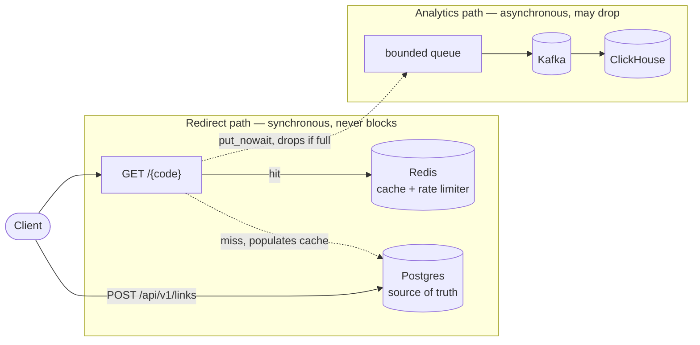

<p align="center">
  
</p>

<h1 align="center">URL Shortener</h1>

<p align="center">
  A FastAPI URL shortener built around one idea: the redirect path and the analytics
  path have opposite goals, so the architecture keeps them from ever touching.
</p>

<p align="center">
  
  
  <a href="https://github.com/ai-fn/url-shortener/actions/workflows/ci.yml"></a>
  
</p>

---

Redirects must do almost nothing; analytics wants to record everything. Every
structural decision in this repo follows from keeping those two apart:

```
GET /{code}  →  Redis  →  302                          (synchronous, must never block)
             →  bounded queue  →  Kafka  →  ClickHouse (asynchronous, may drop)
```

**Analytics is allowed to lose data. Redirects are not allowed to be slow.** When
those two conflict, redirects win — every time, without discussion. The full design
lives in [`docs/ARCHITECTURE.md`](docs/ARCHITECTURE.md).

## Features

What's live today (milestone 2):

- **Link CRUD** — create, read, update, and soft-delete short links via a REST API,
  with optional custom aliases, titles, descriptions, and expiry.
- **SSRF-hardened URL validation** — every target URL is resolved and every
  returned address classified before storage, closing the classic bypasses
  (encoded/octal/decimal IPs, IPv4-mapped IPv6, CGNAT, the cloud metadata
  endpoint) rather than pattern-matching the input string.
- **Atomic Redis rate limiting** — a Lua token bucket protects link creation and
  the redirect's 404 budget, with an explicit fail-open/fail-closed policy per
  endpoint instead of one default for both.
- **Safe-by-construction redirects** — always `302` with `Cache-Control: no-store`,
  a reserved-path-aware catch-all route, and header-injection checks on the way out.
- **Schema managed by Alembic**, driven by the same `Settings` the app itself reads,
  so migrations and the running service can never target different databases.

Targeted by the architecture, not yet built: the Redis redirect cache, Kafka click
transport, and ClickHouse analytics pipeline. See [Roadmap](#status).

## Architecture



| Component | Role | May the redirect block on it? |
|---|---|---|
| Postgres | Source of truth for links (and users, later) | Only on a cache miss |
| Redis | Redirect cache and rate limiter — never a source of truth | Yes, it's the fast path |
| Kafka | Click event transport | **No** |
| ClickHouse | Analytics store, ingesting via its native Kafka table engine | **No** |

Redis is invalidated with `DEL`, never `SET` — a `SET` races an in-flight reader
holding a stale row. Kafka and ClickHouse are deliberately excluded from `/readyz`:
a redirect still succeeds with both down, so failing readiness on them would take
the whole service offline to protect analytics — exactly backwards.

## Stack

Python 3.12 · FastAPI · SQLAlchemy (async) + asyncpg · Alembic · Redis · Kafka
(aiokafka) · ClickHouse · structlog · [uv](https://docs.astral.sh/uv/) ·
ruff + mypy (strict) · pytest + pytest-asyncio · Docker Compose.

## Prerequisites

- Python 3.12
- [`uv`](https://docs.astral.sh/uv/)
- Docker, for the local dependency stack (Postgres, Redis, Kafka, ClickHouse)

## Getting started

```bash
git clone https://github.com/ai-fn/url-shortener.git
cd url-shortener

uv sync                    # install (Python 3.12)
```

```bash
# .env configures host-side runs (pytest, alembic, scripts). The compose stack does
# NOT read it — every value the api container uses is set in docker-compose.yml —
# so editing .env and restarting compose changes nothing.
cp .env.example .env
docker compose up -d --wait

curl -i localhost:8000/healthz    # liveness — no dependencies
curl -i localhost:8000/readyz     # readiness — Postgres + Redis
open http://localhost:8000/docs
```

## Usage

```bash
# Create a short link
curl -X POST localhost:8000/api/v1/links \
  -H 'content-type: application/json' \
  -d '{"target_url": "https://example.com/", "title": "demo"}'

# Follow it — 302, Cache-Control: no-store
curl -i localhost:8000/<short_code>
```

| Command | Description |
|---|---|
| `uv run pytest -m "not integration"` | Unit tests — no containers, under ~10s |
| `uv run pytest -m integration` | Integration tests — needs the compose stack up |
| `uv run ruff check . && uv run ruff format .` | Lint and format |
| `uv run mypy app/` | Type check (strict) |
| `uv run python scripts/check_invariants.py` | Architectural invariant gate |
| `uv run alembic upgrade head` | Apply migrations (host-side, against `.env`) |
| `docker compose up -d --wait` | Start the full local stack, migrations included |

## Configuration

Every setting is env-overridable through `app/config.py`'s `Settings`. Copy
[`.env.example`](.env.example) to `.env` for host-side runs (pytest, Alembic); the
compose stack sets its own values directly in `docker-compose.yml`.

> [!IMPORTANT]
> `SECRET_KEY` and `IP_HASH_KEY` must be ≥32 characters and replaced before any
> non-local use. Generate one with `python -c "import secrets; print(secrets.token_urlsafe(48))"`.

## Project structure

```
app/
  api/            # Route handlers — thin adapters, no business logic
                  #   redirect.py is the hot path; changes here need unusual care
  services/       # Business logic — routes delegate here
  core/           # Short codes, URL validation, rate limiting
  models/         # SQLAlchemy ORM models
clickhouse/       # Server config for the compose container today;
                  #   numbered SQL migrations land with the analytics milestone
migrations/       # Alembic, Postgres only
scripts/          # check_invariants.py — the committed architectural gate
tests/            # Unit (no containers) + integration (needs the compose stack)
docs/
  ARCHITECTURE.md # The full design
```

## Documentation

- [`docs/ARCHITECTURE.md`](docs/ARCHITECTURE.md) — the full system design: the
  redirect path, the analytics path, and why they're built the way they are.

## License

MIT — see [`LICENSE`](LICENSE) for the full text.
